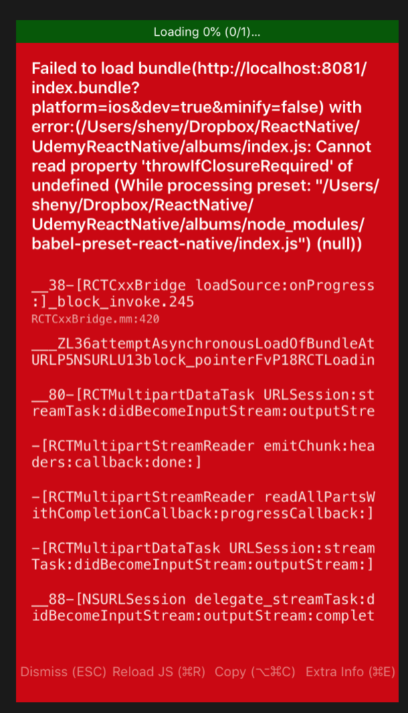
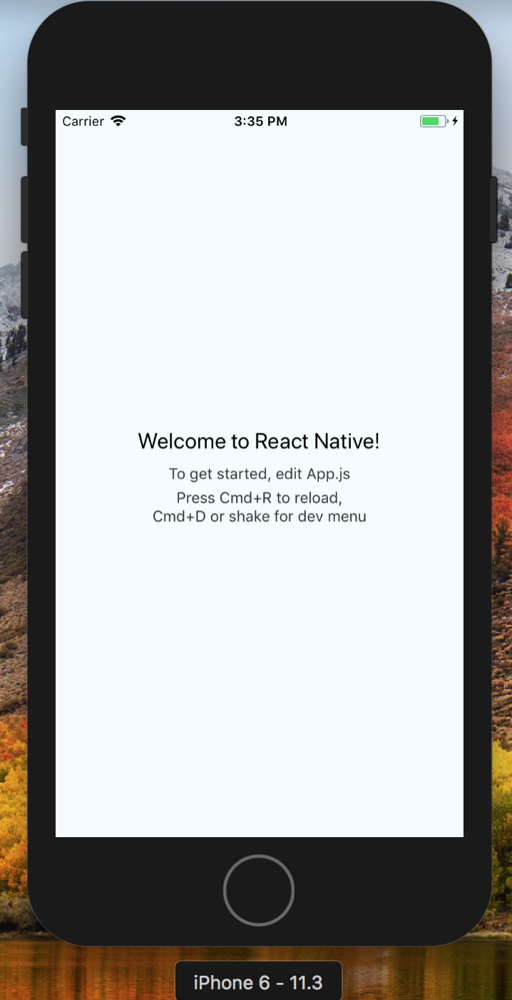

# Albums - React Native practice project

## Udemy Course
This repo contains the code for Albums project, which is a demo project in Stephen Grider's Udemy Course: [The Complete React Native and Redux Course](
https://www.udemy.com/the-complete-react-native-and-redux-course/learn/v4/overview)

The official repo for this course: https://github.com/StephenGrider/ReactNativeReduxCasts

## My Study Notes
### Setup
To set up the development environment for React Native, follow this guide:
[React Native - Getting Started](https://facebook.github.io/react-native/docs/getting-started.html)

I installed XCode, HomeBrew, Node/NPM, watchman, RN CLI.

```
To run your app on iOS:
  cd to project root directory
  react-native run-ios
  - or -
  Open ios/albums.xcodeproj in Xcode
  Hit the Run button
To run your app on Android:
  cd to project root directory
  Have an Android emulator running (quickest way to get started), or a device connected
  react-native run-android
```

#### troubleshooting
At first I had this error:



reference: https://github.com/facebook/react-native/issues/18962

To fix this, downgrade babel from 5.0.0 to 4.0.0 in `package.json`:
```
"babel-preset-react-native": "4.0.0",
```

Then it worked.


